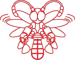

<h1 align="center">
  

    
  

  Firefly Components
</h1>

Firefly Components es un pequeño set de componentes reutilizables hechos en React ⚛ y estilados con la libreria Styled Components 💅, usados en las aplicaciones web de Lámparas Estella S.A. de C.V.

## ⚙ Dependencias

-   [React.js +17.0](https://es.reactjs.org/)
-   [Styled Components +5.0](https://styled-components.com/)
-   [React-select +5.4](https://react-select.com/home)

## ⭐ Características

-   Diseño minimalista
-   Tema claro y oscuro

## 🪲 Bugs y feedback

Sientete libre de reportar busgs o dar feedback para mejorar los componentes o la documentación en la sección issuses de este repositorio.
